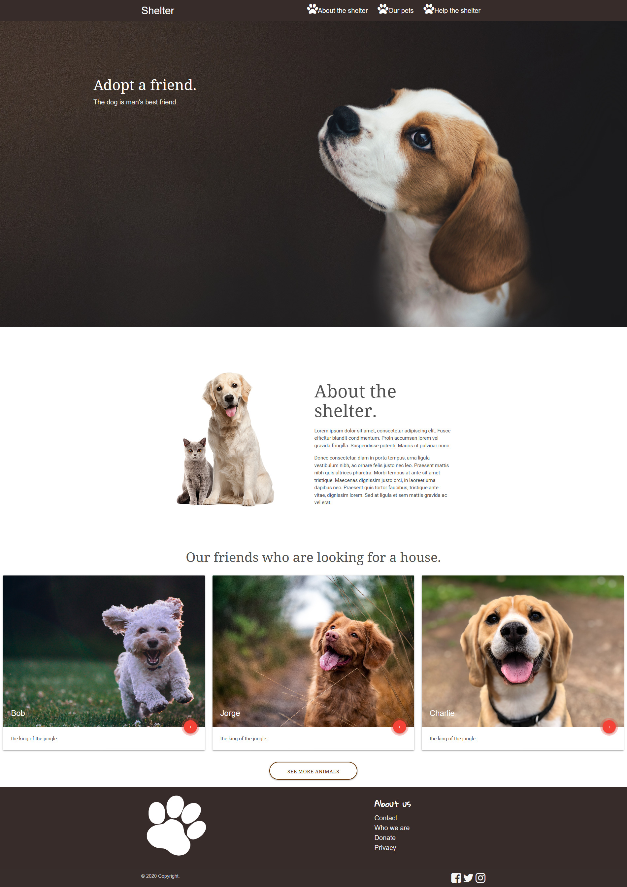
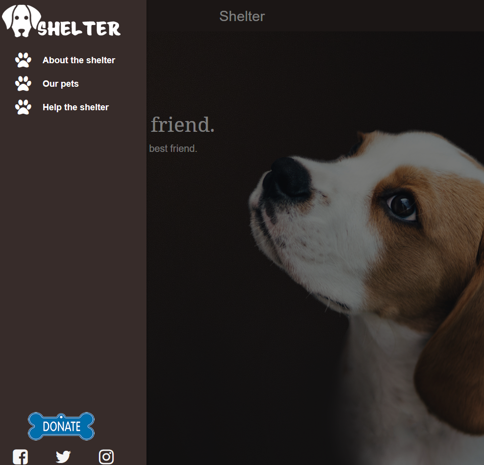
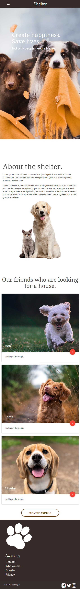

# DogShelter_WebSite

<h1>Projeto de Site para Adoção de Cachorros</h1>

<h2>Sobre o Projeto</h2>

Nos dias de hoje, a adoção de animais de estimação é uma prática cada vez mais valorizada, e a tecnologia pode desempenhar um papel fundamental nesse processo. O projeto consiste no desenvolvimento de um site visando criar uma plataforma amigável e acessível, que conecte pessoas dispostas a adotar com cães que precisam de um lar amoroso. Este projeto não apenas facilita a adoção, mas também promove a conscientização sobre a importância da adoção responsável

<h2>Linguagens e Bibliotecas Utilizadas</h2>

  

<h2>HTML(HyperText Markup Language)</h2>

É a linguagem de marcação padrão utilizada para criar e estruturar páginas da web. Ela define a estrutura do conteúdo na internet, permitindo que elementos como textos, imagens, links e vídeos sejam organizados e apresentados de forma adequada em navegadores

<h2>CSS(Cascading Style Sheets)</h2>

CSS é uma linguagem utilizada para estilizar e formatar a apresentação de páginas web.

<h2>Materialize</h2>

Materialize é um framework front-end baseado no design Material Design, criado pelo Google. Ele fornece uma coleção de componentes e estilos prontos para uso, facilitando o desenvolvimento de interfaces web responsivas e modernas.

<h2>Resumo do Projeto</h2>

 

 

 

